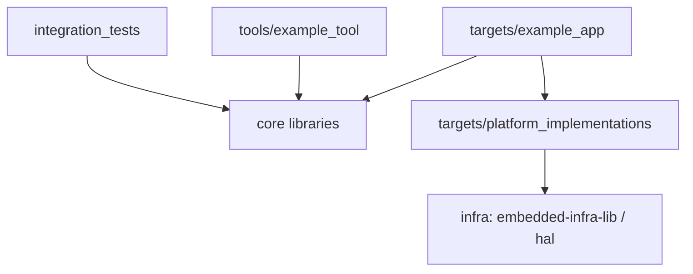
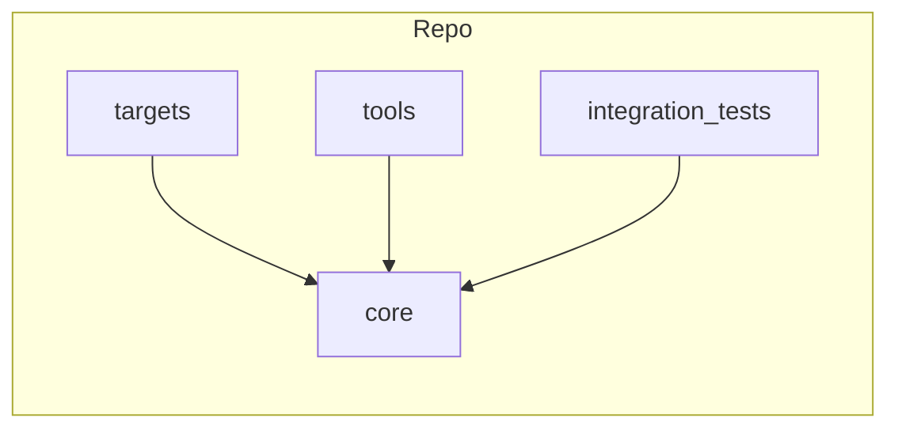

| Field     | Value               |
|-----------|---------------------|
| Title     | System Architecture |
| Type      | architecture        |
| Status    | draft               |
| Version   | 0.1.0               |
| Component | system              |
| Date      | 2026-06-21          |

> **Example document** — replace this with the real architecture of your project.
> It demonstrates the structure the documentation-validation CI expects (see
> `documentation/templates/architecture.md`). Diagrams must be Mermaid or ASCII art;
> external image references are not allowed.

---

## Assumptions & Constraints

- **Constraint**: no dynamic memory allocation in runtime/embedded code paths.
- **Constraint**: application logic depends only on abstractions in `core/`, never on a concrete MCU.
- **Assumption**: a host build exists for off-target testing and simulation.

---

## System Overview

The scaffold separates portable logic from hardware. Application entry points in
`targets/` wire a platform `Board` into reusable libraries from `core/`. Host tools
and BDD integration tests exercise the same `core/` libraries off-target.

---

## Component Decomposition

| Sub-component | Responsibility |
|---------------|----------------|
| core          | Reusable libraries (interfaces + implementations), no entry points |
| targets       | Application entry points and platform-specific board implementations |
| tools         | Host-side developer utilities that reuse core libraries |
| integration_tests | BDD specification of end-to-end behaviour |

---

## Interfaces & Contracts

### Provided Interfaces

| Interface | Direction | Purpose | Invariants |
|-----------|-----------|---------|------------|
| Application entry point | provided | Boots the system and runs the main loop | Constructs platform before logic |

### Required Interfaces

| Interface | Direction | Purpose | Invariants |
|-----------|-----------|---------|------------|
| Platform Board | required | Exposes peripherals to the application | No heap; portable across host/target |

---

## Open Questions & Decisions

| # | Question / Decision | Status | Options Considered | Rationale |
|---|---------------------|--------|--------------------|-----------|
| 1 | Replace example component with real domain | open | — | Scaffold placeholder |
