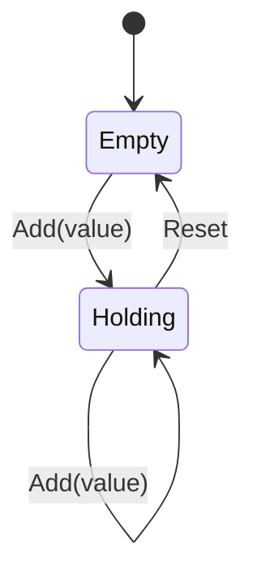

| Field     | Value                     |
|-----------|---------------------------|
| Title     | Example Component Design  |
| Type      | design                    |
| Status    | draft                     |
| Component | example_component         |
| Version   | 0.1.0                     |
| Date      | 2026-06-21                |

> **Example document** — replace with the design of a real component. This mirrors
> `documentation/templates/design.md`: behaviour only, no code blocks; diagrams must
> be Mermaid or ASCII art.

---

## Responsibilities

**Is responsible for:**
- Maintaining a running integer total as values are added.

**Is NOT responsible for:**
- Persistence, concurrency, or input parsing (callers handle those).

---

## Component Details

### Part A — Accumulation

Holds a single integer total. Adding a value increases the total; resetting returns
the total to zero. The operation is deterministic and allocation-free.

---

## Interfaces

### Provided

| Interface   | Purpose                       | Contract                          |
|-------------|-------------------------------|-----------------------------------|
| Accumulator | Add / read / reset a total    | Total reflects the sum of inputs since the last reset |

### Required

| Interface | Purpose | Contract |
|-----------|---------|----------|
| —         | none    | Self-contained |

---

## State Machine

---

## Constraints & Limitations

| Constraint | Value / Description |
|------------|---------------------|
| Overflow   | Total is a 32-bit signed integer; callers must avoid overflow |
| Allocation | No dynamic memory used |
