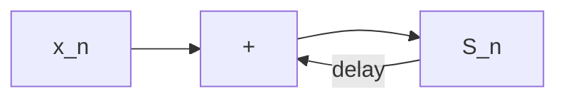

| Field     | Value             |
|-----------|-------------------|
| Title     | Running Sum       |
| Type      | theory            |
| Status    | draft             |
| Component | example_component |
| Version   | 0.1.0             |
| Date      | 2026-06-21        |

> **Example document** — replace with the mathematical/engineering theory behind a
> real component. Mirrors `documentation/templates/theory.md`. Equations use KaTeX.

---

## Overview

The example component computes a running sum: the total after $n$ additions is the
sum of all values added since the last reset.

---

## Prerequisites

| Symbol | Meaning              | Unit |
|--------|----------------------|------|
| $x_i$  | the $i$-th added value | —  |
| $S_n$  | total after $n$ adds | —    |

---

## Mathematical Foundation

### Model / Setup

Each call adds a value to the accumulated total; reset sets the total to zero.

### Derivation

The total satisfies the recurrence $S_n = S_{n-1} + x_n$ with $S_0 = 0$.

### Key Results

$$
S_n = \sum_{i=1}^{n} x_i
$$

---

## Block Diagrams

---

## Numerical Properties

| Property   | Value / Condition |
|------------|-------------------|
| Complexity | O(1) per add      |
| Precision  | exact for 32-bit integers within range |
| Stability  | no accumulation error |
| Range      | bounded by int32 limits |
